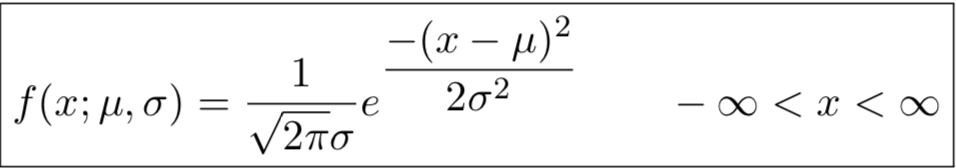

# Cheatsheet for Lecture 8
Class: ECSE 305
Date: October 23 and 25, 2018

## Normal Distribution

  > Normal distribution can fit several real life numerical population.

  > The normal or Gaussian distribution is a continuous function that looks like the following:
  
  Where mmu is the E(X) and sigma squared is V(X).

  > The standard variation stretches the distribution horizontally while the expected value shift the curve completely horizontally.

### Standard Normal Distribution

### Percentile of the Standard Normal Distribution

### Notation for Critical Values

### Non-Standard Normal Distribution

### Approximating the Binomial Distribution

## Exponential Distribution

## Probability Plots
